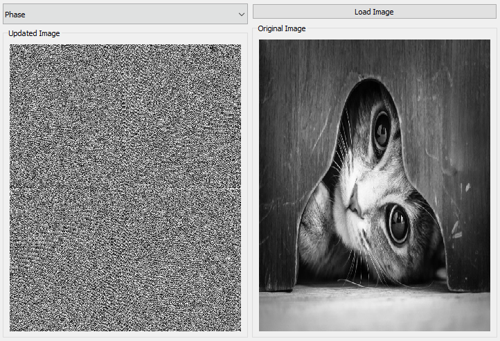
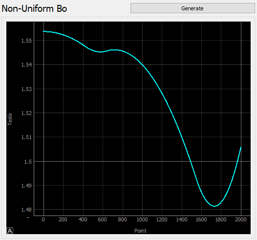
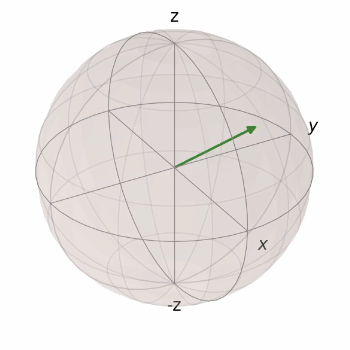
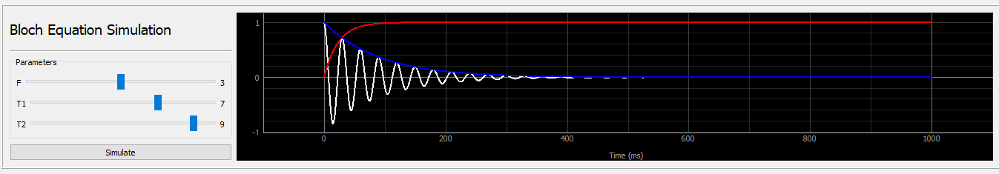

# MRI Task 1 Report

| Name                    | Section | Bench Number |
|-------------------------|---------|-------------:|
| Ahmed Salah El-Din      | 1       |            5 |
| Ahmed Adel Ahmed        | 1       |           6  |
| Salma Ayman Ahmed       | 1       |           37 |
| Abdullah Mohammed Sabry | 2       |            8 |

Fourier Transform
---

By applying the Discrete Fast Fourier Transform method, we obtained the Fourier Transform of an image, we then plotted its Components (Magnitude, Phase, Real Part, Imaginary Part) Separately.

---

Magnitude of an Image:

---

---

It's Phase

---

---

Non-Uniform Magnetic Field
---

We created a function that simulates the non-uniformity of a magnet, giving it the theoretical magnetic flux density in Tesla, maximum deviation due to the non-uniformity and the length of the magnet, using this data it generates a random curve we then plot this curve in our program.

---

---
Relaxation Process
---

It’s a process where the spins, which received a Radio Frequency pulse which caused it to change the direction of its field, to release the energy it received from the pulse while returning to its original position

---

The following image demonstrates the Rotating Frame

---

---

The Precession

---

---
Bloch Equation Simulation
---

##### Transverse Relaxation.

Transverse relaxation is an exponential decay process of the x and y components of magnetization that is always happening. Pulse Echo Time `TE` is the waiting time after the `RF` pulse sequence before measuring the signal. Mathematically this means 

$$Mx(t)=Mx(0)exp(-TE/T2)$$     (1)

and

$$My(t)=My(0)exp(-TE/T2)$$       (2)

the blue line in the plot shows how it happened.

##### Longitudinal Relaxation.

Longitudinal `z` relaxation is a bit more complicated than transverse relaxation. The magnetization recovers exponentially with a time constant T1, to a non-zero value, often called M0. Pulse Repetition Time `TR` is the time between 2 successive `RF` Pulse sequence .Mathematically, we write 

$$Mz(t)=M0*[1-exp(-TR/T1)]$$     (3)

the red line in the plot shows how it happened.

