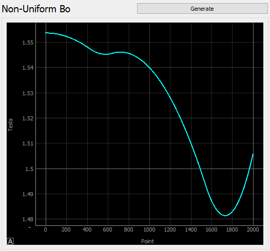

# MRI Task 1 Report

| Name                    | Section | Bench Number |
|-------------------------|---------|-------------:|
| Ahmed Salah El-Din      | 1       |            5 |
| Ahmed Adel Ahmed        | 1       |           6  |
| Salma Ayman Ahmed       | 1       |           37 |
| Abdullah Mohammed Sabry | 2       |            8 |

Fourier Transform
---

By applying the Discrete Fast Fourier Transform method, we obtained the Fourier Transform of an image, we then plotted its Components (Magnitude, Phase, Real Part, Imaginary Part) Separately.

---

Magnitude of an Image:

---

---

It's Phase

---

---

Non-Uniform Magnetic Field
---

We created a function that simulates the non-uniformity of a magnet, giving it the theoretical magnetic flux density in Tesla, maximum deviation due to the non-uniformity and the length of the magnet, using this data it generates a random curve we then plot this curve in our program.

---

---
Relaxation Process
---

It’s a process where the spins, which received a Radio Frequency pulse which caused it to change the direction of its field, to release the energy it received from the pulse while returning to its original position

---

The following image demonstrates the Rotating Frame

---

---

The Precession

---

---
Bloch Equation Simulation
---

###### Pulse Repetition Time (TR)
the red line in the plot explain the time between 2 successive RF pulse sequence

 $\alpha$

$$e = mc^2$$

<html>
<head>
<title>MathJax TeX Test Page</title>

</head>
<body>
When \(a \ne 0\), there are two solutions to \(ax^2 + bx + c = 0\) and they are
$$x = {-b \pm \sqrt{b^2-4ac} \over 2a}.$$
</body>
</html>
